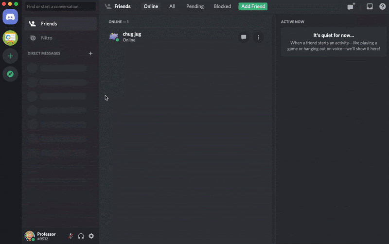
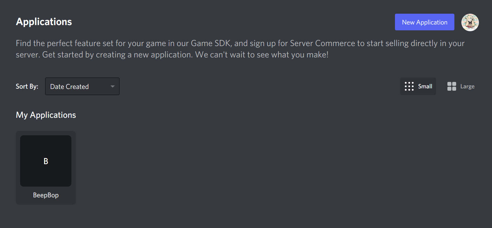
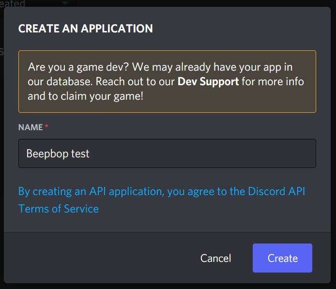
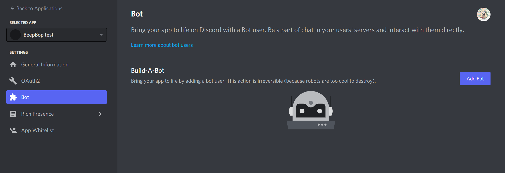
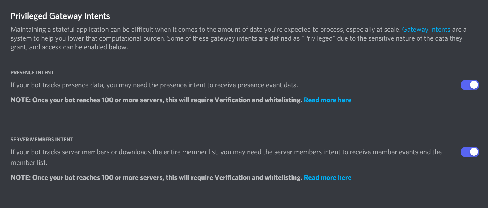
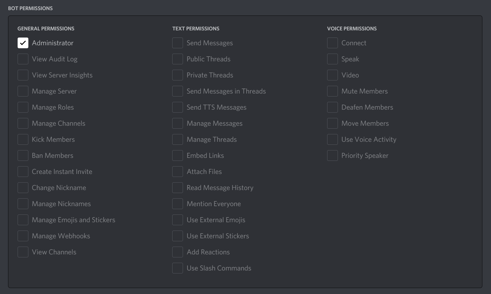
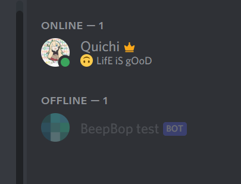
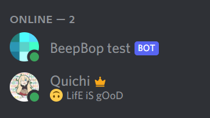

# Local testing environment setup

## Setting up a testing bot

First, create a new discord server for local testing



Then, head to the [discord developer portal](https://discord.com/developers/applications) and create a new application. You can name the bot whatever name you want, it will only be used for local testing anyways.





Then, go to the **Bot** section on the left and hit the **Add Bot** button to add a bot.



Then, scroll down and enable these two settings, this will make testing a lot easier.



After that, go to the OAuth2 section and select bot under the *SCOPES* block.


Once you've selected the bot scope, a block will pop up underneath showing bot permissions. For the sake of local testing, we will enable **administrator** privileges for the bot.



Now, copy the link that is included inside of the scope block where we selected bot and paste it into your browser. This should open up a prompt to add your bot to a server. Then, go ahead and add the bot to the server that you had previously created.


Your bot should now be added to your server, and we are ready to set up the actual code environment!



## Setting up the code environment

This project uses python so make sure you have python 3 installed! You can download python [here](https://www.python.org/)

First, clone the repository onto your local machine!

> git clone https://github.com/ianw3214/Beepbop.git

Once you have pulled all the code, you will need a local settings file so that the code can access your own bot. Back in your bot settings in the discord developers portal, look for your bots token and click *reveal token* to get your bots secret token. DO NOT share this with other people unless you want to be sad.


Now, create a new file called **settings.json** in the root folder of the repository. This file is part of the gitignore so you do not need to worry about any secrets going public here. The contents of the json file should look like this:

```json
{
    "token": "<YOUR-DISCORD-BOT-TOKEN-HERE>",
    "channel" : "<YOUR-CHANNEL-NAME-HERE>",
    "channelID" : "<YOUR-CHANNEL-ID-HERE>"
}
```

Now, if you run the **main.py** file in your terminal, everything should work properly. If you see the bot online on your discord server, then it menas everything is running properly!

*Note:* To find you discord channel ID, enable developer mode in settings -> advanced, then right click your channel and click *copy ID*.

> py main.py



*An alternative to the settings.json file is to alter your environment variables to store your discord bot token, this is how it is handled in production. Setting your environment variable 'DISCORD_TOKEN' to your token will also work!*